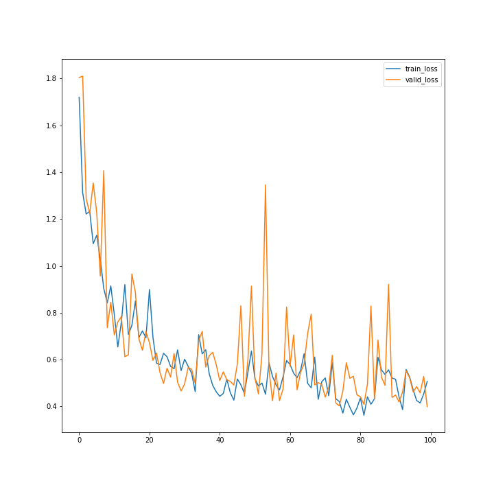
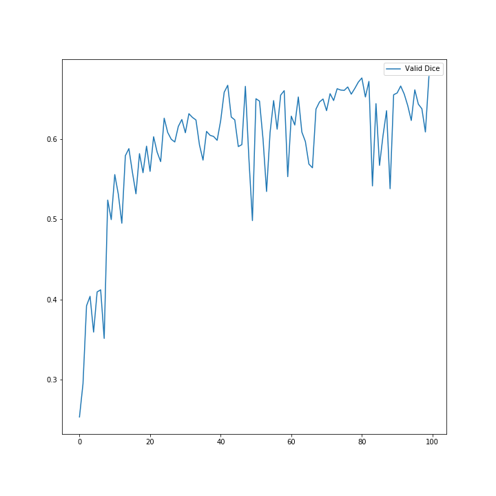
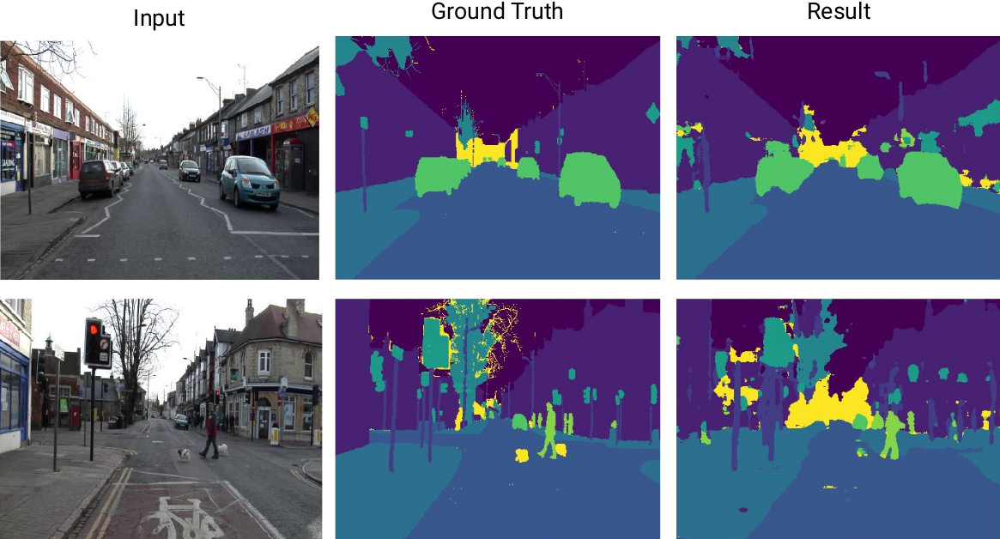

# Linknet-NNFL-Project
Implementation of paper: __Linknet: Exploiting Encoder Representations for Efficient Semantic Segmentation__

## Instructions
The linknet_model.py file contains the code for the implemented linknet model. The dataloaders and training codes for each dataset are in the respective train notebooks.

First create the conda environment. Open up a terminal and type:

    git clone https://github.com/Atom-101/Linknet-NNFL-Project.git
    cd Linknet-NNFL-Project
    conda env create -f environment.yml
    conda activate nnfl_project // optional
    jupyter notebook

Run all cells in a notebook to train a linknet model and evaluate it.

## Description
Linknet is a deep learning model for semantic segmentation. Semantic segmentation is way of grouping pixels in a semantically meaningful way, so that every pixel in the image is labeled with the class (for eg., person, road, building) of its enclosing object.

#### Model
Existing techniques try to make the network deeper to improve performance. Evidence reveals that network depth is of crucial importance, but it leads to vanishing gradients, loss of information and degrading accuracy. LinkNet uses residual/bypass connections, bypassing spatial information directly from the encoder to the decoder, thus preventing information loss at each level of the encoder and achieving a significant decrease in running time, making real-time semantic segmentation accurate and efficient.

LinkNet uses ResNet-18 (11M parameters) as its encoder, which is a fairly lighter network as compared to VGG16 (138M parameters) and ResNet-101 (45M parameters) used in contemporary segmentation models.

#### Datset
The model was trained on the Camvid and Cityscapes dataset. Both these datasets consist of video frames depicting urban areas, annotated pixel wise. The original Camvid dataset has 376 training images, 101 validation and 233 test images. Each image has a size of 960x720 pixels with 32 discrete classes. The authors fused similar classes to reduce the number to 12. They also reduce the size of images to 768x576 to make it easier to fit the dataset. The cityscapes dataset has 2975 training and 500 validation images. Each image has a size of 2048x1024 with 34 discrete classes. The authors reduce the number of classes to 19 and image size to 1024x512. *We were unable to find this 19 class version of the dataset and used the original 34 class version.*

#### Training
We train the model using weighted cross-entropy loss. This loss function assigns higher weights to less frequently occuring classes in the dataset. It is helpful in dealing with the heavy class imbalance in the dataset. The paper mentions to set the class weights as 1/ln(p + 1.02) where p is the frequency of a particular class. The Camvid model is trained for 100 epochs. Due to resource constraints we were only able to train the Cityscapes model for 20 epochs. 
| | |
|:--------:|:--------:|
|||
|Validation and Train Losses during training | Validation IoU during training |

#### Modifications Tried
We tried training a model with the following modifications to the original approach. The results with this model are mentioned below.
* **AdamW with One Cycle learning rate schedule** AdamW is a modified version of Adam that implements weight decay for regularization. One cycle is a learning rate schedule which consists of starting with a moderate lr, going to a high lr following a half-cosine curve and coming back down to a very low lr. This cyclic learning rate has been attributed to model convergence with lesser amount of training epochs(super-convergence).
* **Sub-pixel convolutions** We swapped the deconvolution layers in the decoder with sub-pixel convolution layers. These layers are mathematically equivalent to deconvolution, but are computationally much faster.

## Camvid results
The following were our results on the Camvid dataset. We were able to get results similar to the original paper implementation. Our modified model although faster, showed a lower performance on the IoU metric.
| Model | IoU |
|:--------:|:---------:|
| Segnet| 65.2|
| Enet| 68.3|
| Dilation8 | 65.3|
| Linknet(original) | 68.3|
| Linknet(ours, original) | 67.6 |
| Linknet(ours, with modifications)| 65.2|

